# PHẦN 2. XÂY DỰNG VÀ THIẾT KẾ WEBSITE

---

## 2.1. Mục tiêu xây dựng website

Website WanderHUB được xây dựng để biến một dịch vụ vốn vô hình — thiết kế và điều phối lịch trình trải nghiệm đô thị — thành một sản phẩm số có thể giao dịch trực tuyến trọn vẹn, từ lúc khách tìm hiểu đến lúc thanh toán và sử dụng dịch vụ thực tế, mà không cần qua bước nhắn tin chờ tư vấn như cách vận hành phổ biến của các đơn vị tour custom hiện nay. Website hướng đến năm mục tiêu cụ thể:

**Thứ nhất, số hóa sản phẩm dịch vụ thành một "món hàng" có đầy đủ thành phần thương mại.** Vì WanderHUB không bán hàng hóa vật lý, website phải biến lịch trình do AI tạo ra thành sản phẩm có tên gọi, mô tả, hình ảnh, mức giá và nút hành động mua/đăng ký rõ ràng, giống cách một sản phẩm e-commerce chuẩn được trình bày.

**Thứ hai, thay thế quy trình tư vấn thủ công bằng AI tự động, rút ngắn thời gian ra quyết định của khách.** Khách chỉ cần nhập mood, ngân sách, khu vực và thời gian rảnh, hệ thống sẽ trả về một lịch trình hoàn chỉnh trong vài giây, thay vì phải chờ nhân viên phản hồi qua tin nhắn.

**Thứ ba, vận hành đồng thời mô hình freemium ba gói (Free/Basic – Premium – International Tourist) để vừa thu hút người dùng mới, vừa tạo doanh thu định kỳ.** Website là nơi duy nhất khách có thể xem, so sánh, đăng ký và thanh toán các gói này, do đó cũng chính là điểm chốt doanh thu của toàn bộ mô hình kinh doanh.

**Thứ tư, đóng vai trò điểm đến cuối cho mọi kênh truyền thông.** Mọi nội dung quảng bá trên mạng xã hội đều cần một nơi để "đổ" traffic về, chuyển đổi thành tài khoản đăng ký và sau đó thành giao dịch trả phí — website chính là điểm hội tụ đó.

**Thứ năm, tạo cảm giác an toàn và đáng tin cậy cho khách hàng, đặc biệt là khách quốc tế lần đầu đến TP.HCM.** Giao diện, nội dung và quy trình thanh toán cần minh bạch, có bằng chứng cụ thể (điểm số AI, mô tả chi tiết địa điểm, thông tin chuyển khoản rõ ràng) để giảm tâm lý lo lắng khi sử dụng một dịch vụ mới.

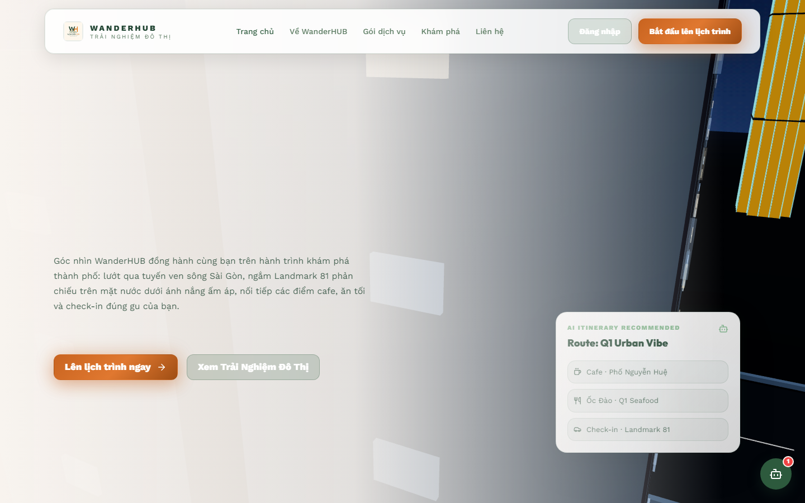
*Hình 2.1: Trang chủ website — nơi truyền tải mục tiêu định vị thương hiệu và CTA dẫn vào dịch vụ.*

---

## 2.2. Cấu trúc website

Website được xây dựng dưới dạng một ứng dụng web hiện đại, phản hồi nhanh và không cần tải lại trang khi chuyển đổi giữa các mục — toàn bộ thao tác từ xem thông tin, đăng ký, tạo lịch trình đến thanh toán diễn ra liền mạch trong một trải nghiệm duy nhất. Cấu trúc menu chính trên thanh điều hướng được sắp xếp theo đúng hành trình nhận biết – tìm hiểu – giao dịch của khách hàng:

| Menu | Đường dẫn | Vai trò trong cấu trúc |
|---|---|---|
| Trang chủ | `/` | Giới thiệu tổng quan, hero section, lý do chọn dịch vụ, dẫn vào công cụ lập lịch trình |
| Về WanderHUB | `/about` | Câu chuyện thương hiệu, cách AI kết hợp am hiểu địa phương |
| Gói dịch vụ | `/pricing` | Bảng so sánh ba gói dịch vụ và cổng thanh toán |
| Khám phá | `/explore` | Nội dung dạng blog/POV theo từng "vibe", hỗ trợ nuôi dưỡng khách trước khi mua |
| Đánh giá | `/reviews` | Nhận xét thực tế từ người dùng, tăng độ tin cậy thương hiệu |
| Liên hệ | `/contact` | Form gửi yêu cầu hỗ trợ |
| Đăng nhập/Đăng ký | `/auth` | Cổng xác thực, điều kiện bắt buộc trước khi vào công cụ lập lịch trình |
| Lên lịch trình | `/planner` | Trang lõi — nơi diễn ra giao dịch dịch vụ chính: AI tạo route, đặt xe, theo dõi hành trình |
| FAQ, Điều khoản | `/faq`, `/terms` | Trang hỗ trợ, tăng độ tin cậy và minh bạch pháp lý |

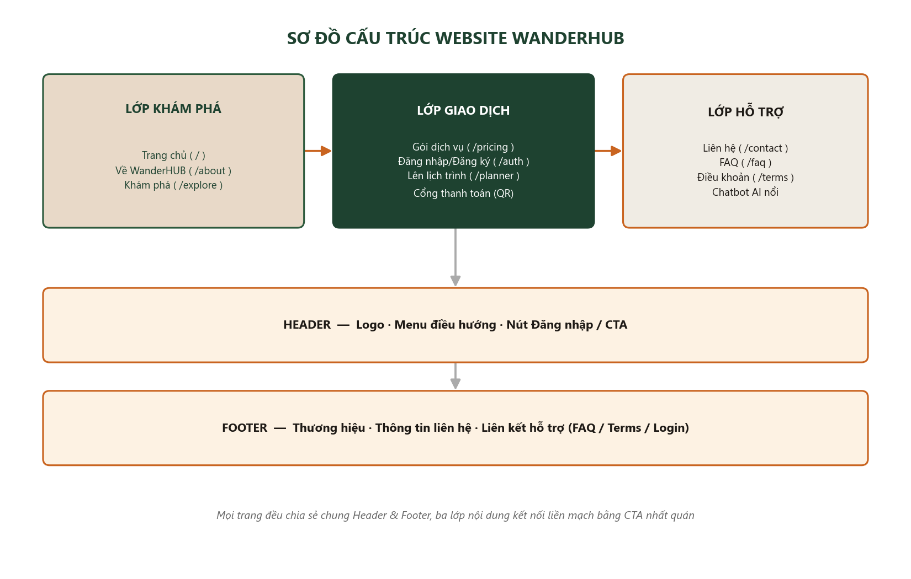
*Hình 2.2: Sơ đồ cấu trúc (sitemap) website theo 3 lớp Khám phá – Giao dịch – Hỗ trợ.*
> *(Hình tự vẽ bằng PowerPoint/Canva/draw.io: 3 khối "Lớp khám phá / Lớp giao dịch / Lớp hỗ trợ", có mũi tên nối Trang chủ → Pricing/Planner → Payment.)*

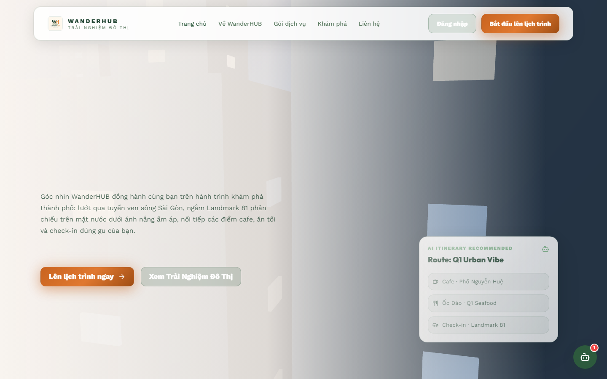
*Hình 2.3: Thanh điều hướng chính, thể hiện đầy đủ các mục menu và nút Đăng nhập.*

Toàn bộ cấu trúc có thể nhóm thành ba lớp chức năng:

- **Lớp khám phá:** Trang chủ, Về chúng tôi, Khám phá — phục vụ khách đang tìm hiểu, xây dựng niềm tin, truyền tải giọng điệu thương hiệu gần gũi.
- **Lớp giao dịch:** Gói dịch vụ, Đăng nhập/Đăng ký, Lên lịch trình, cổng thanh toán — đây là lớp e-commerce thực sự, nơi khách chọn gói, tạo tài khoản, nhập nhu cầu, nhận lịch trình, đặt xe và thanh toán.
- **Lớp hỗ trợ:** Liên hệ, FAQ, Điều khoản, và một trợ lý chat AI nổi xuất hiện trên mọi trang.

Ba lớp được kết nối bằng các nút kêu gọi hành động lặp lại nhất quán ("Lên lịch trình ngay", "Bắt đầu Premium"), giúp khách luôn có lối đi rõ ràng để tiến tới giao dịch.

Hai thành phần cố định xuất hiện trên mọi trang là **Header** và **Footer**. Header gồm logo thương hiệu, menu điều hướng chính và nút đăng nhập/CTA — không có giỏ hàng hay thanh tìm kiếm sản phẩm, vì WanderHUB bán dịch vụ theo yêu cầu chứ không bán danh mục hàng hóa có sẵn. Footer gồm ba khối: giới thiệu ngắn về thương hiệu, thông tin liên hệ, và nhóm liên kết hỗ trợ — đóng vai trò "bản đồ thu nhỏ" của toàn bộ website.

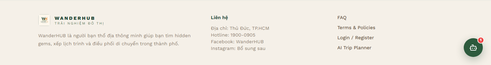
*Hình 2.4: Footer — khối thương hiệu, thông tin liên hệ và liên kết hỗ trợ.*

---

## 2.3. Nội dung và hình ảnh sản phẩm/dịch vụ trên website

Vì sản phẩm là dịch vụ vô hình, nội dung trên website được xây dựng để "vật chất hóa" trải nghiệm — biến những khái niệm trừu tượng như "AI gợi ý lịch trình" thành hình ảnh, câu chữ và số liệu cụ thể mà khách có thể nhìn thấy và tin tưởng ngay từ lần ghé đầu tiên.

**Tại trang chủ:** Hero section sử dụng hiệu ứng chuyển động (cảnh xe chạy qua thành phố, lớp phủ tuyến đường mô phỏng) tái hiện một hành trình thực tế qua các địa danh quen thuộc của TP.HCM như Landmark 81 hay khu vực ven sông Sài Gòn, kèm một thẻ minh họa trực tiếp đầu ra của AI (ví dụ route "Q1 Urban Vibe": cà phê phố Nguyễn Huệ → hải sản kiểu Ốc Đào Q1 → check-in Landmark 81). Cách trình bày này không bán "một tour" mà bán "một câu chuyện hành trình". Tiếp theo là phần "Ba bước – Một hành trình" minh họa quy trình sử dụng dịch vụ bằng hình ảnh số, giúp khách hình dung quy trình mua hàng trước khi thực sự thao tác.

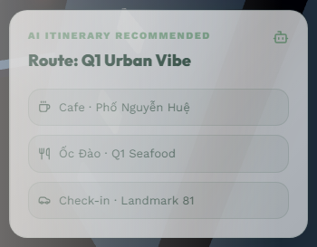
*Hình 2.5: Thẻ minh họa đầu ra AI ngay tại hero — route mẫu "Q1 Urban Vibe".*

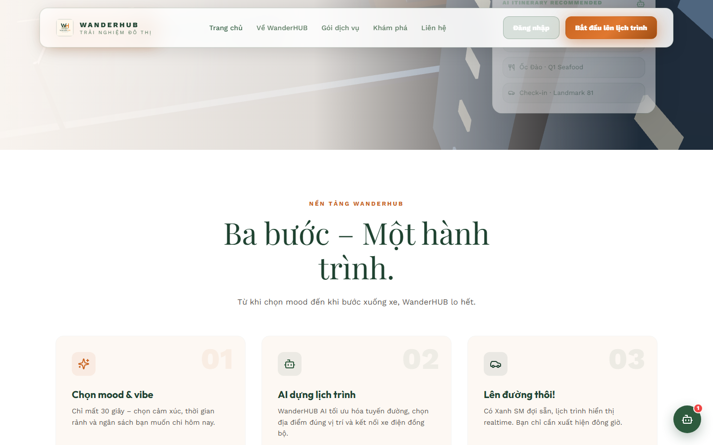
*Hình 2.6: Ba bước sử dụng dịch vụ được trực quan hóa bằng icon và số thứ tự 01–02–03.*

**Tại trang Gói dịch vụ:** Mỗi gói (Basic/Free, Premium, International Tourist) được trình bày đầy đủ thành phần của một sản phẩm e-commerce chuẩn: tên gói, mức giá, mô tả ngắn định vị đối tượng phù hợp, danh sách quyền lợi được đánh dấu tích xanh, danh sách quyền lợi không bao gồm được gạch ngang để khách dễ so sánh, một nhãn nổi bật ("Best vibe") đặt ở gói được ưu tiên bán, và nút hành động thay đổi theo ngữ cảnh ("Dùng miễn phí", "Bắt đầu Premium", hoặc "Đang sử dụng" nếu gói đó đang active).

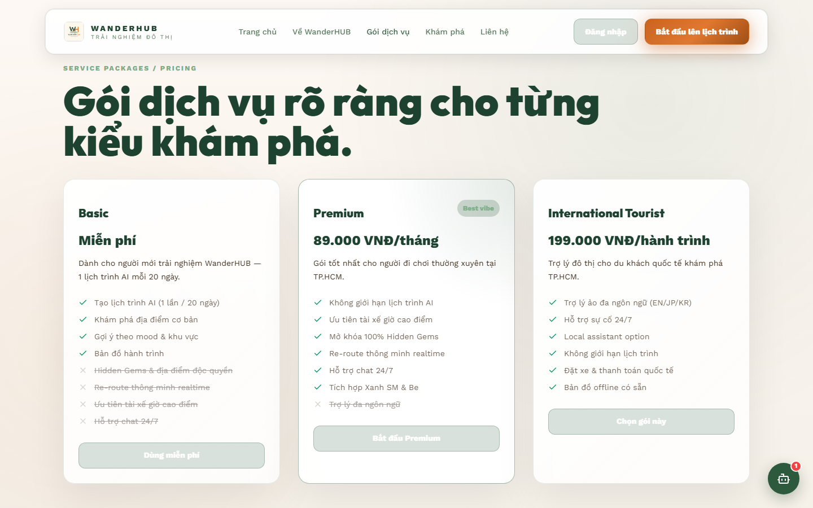
*Hình 2.7: Ba thẻ gói dịch vụ Basic – Premium – International Tourist, có nhãn "Best vibe" ở gói Premium.*

**Tại trang Lên lịch trình (sản phẩm lõi):** Mỗi điểm đến trong lịch trình được hiển thị như một thẻ sản phẩm con, gồm hình ảnh thực địa, tên địa điểm, mô tả ngắn mang giọng văn cá nhân hóa, khung giờ dự kiến, danh mục (cà phê/ẩm thực/về đêm/văn hóa…), điểm phù hợp do AI tính toán, chi phí ước tính và thời lượng dự kiến. Toàn bộ nội dung được sinh từ dữ liệu đối tác thật trong cơ sở dữ liệu — không phải nội dung tĩnh viết sẵn — nên luôn gắn với thông tin có thật, tránh tình trạng AI bịa đặt thông tin.

Ngoài các điểm dừng do AI chọn từ nhu cầu, website còn hiển thị một mục **"Ngoài ra, có thể bạn quan tâm"** riêng biệt phía dưới kết quả chính, liệt kê các điểm gợi ý từ đối tác thương mại có ký kết quảng bá với nền tảng. Mục này được tách biệt rõ ràng để khách luôn phân biệt được đâu là gợi ý thuần dựa trên nhu cầu thực và đâu là nội dung được ưu tiên hiển thị có trả phí. Khi khách bấm "Chọn" một đối tác, điểm đó được thêm vào lịch trình thực tế — xuất hiện trên bản đồ, danh sách lộ trình, popup lịch trình chi tiết và được tính vào tổng chi phí xe.

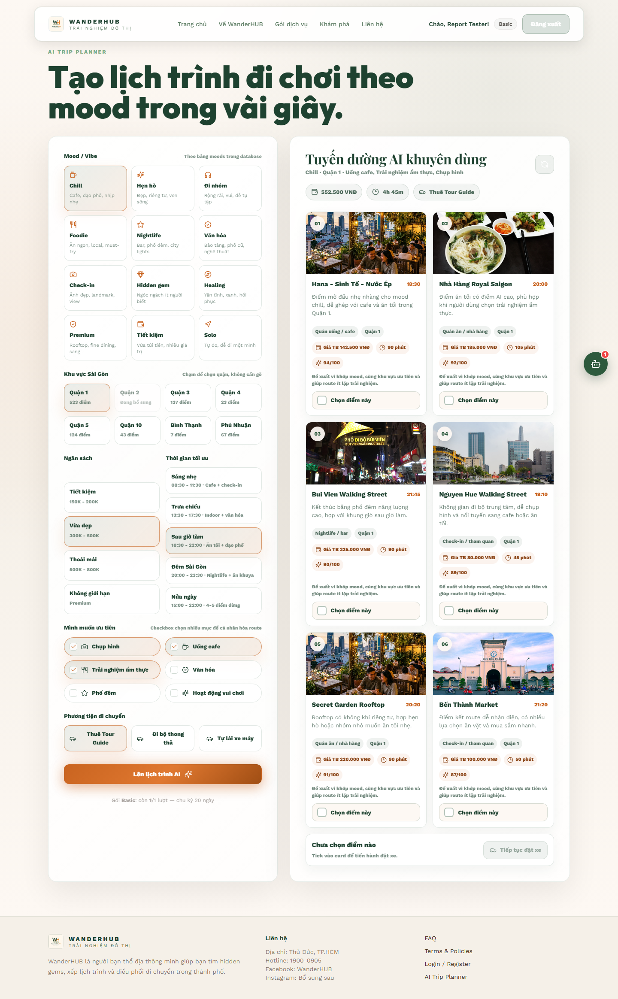
*Hình 2.8: Một điểm dừng trong lịch trình — đầy đủ ảnh, mô tả, điểm AI, chi phí, thời lượng.*

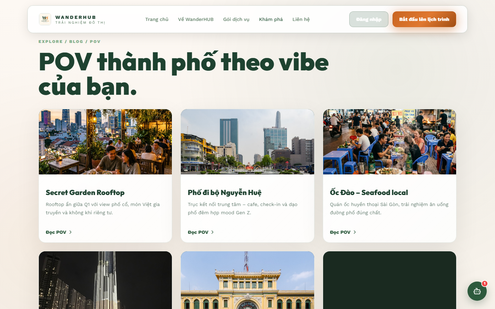
*Hình 2.9: Lưới bài viết Explore theo từng vibe, mỗi bài có ảnh đại diện và nút "Đọc POV".*

**Hình ảnh sản phẩm** được lựa chọn theo logic phân loại danh mục (ảnh dự phòng riêng cho nhóm ẩm thực, cà phê, về đêm, văn hóa, vui chơi…), để bất kỳ điểm đến nào — kể cả khi dữ liệu đối tác chưa có ảnh thật — vẫn hiển thị hình ảnh đúng ngữ cảnh, giữ tính chuyên nghiệp và đồng bộ với phong cách thẩm mỹ hiện đại.

---

## 2.4. Chức năng hỗ trợ giao dịch

Website tích hợp đầy đủ các chức năng cần thiết của một nền tảng thương mại điện tử dịch vụ:

**(1) Xác thực và quản lý tài khoản.** Khách đăng ký/đăng nhập bằng email và mật khẩu; mật khẩu được mã hóa và lưu trữ an toàn, phiên đăng nhập có thời hạn và tự động yêu cầu đăng nhập lại khi hết hạn. Đây là lớp bảo mật tối thiểu bắt buộc đối với nền tảng có phát sinh thanh toán.

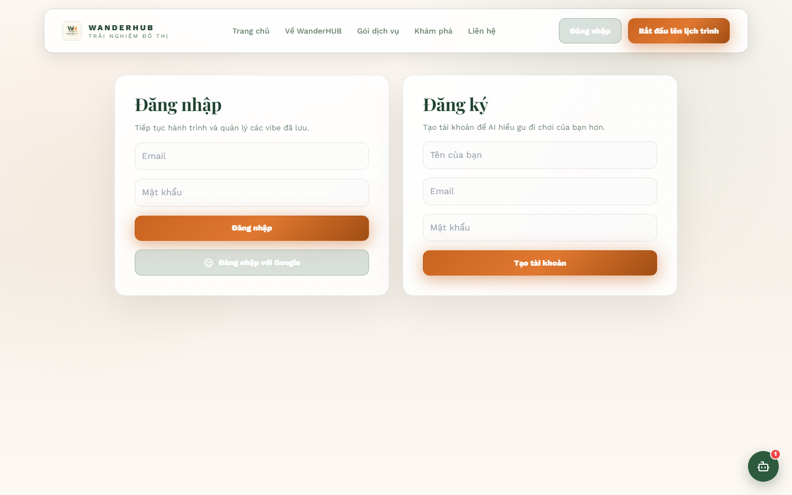
*Hình 2.10: Form Đăng nhập/Đăng ký tài khoản.*

**(2) Công cụ tạo lịch trình bằng AI.** Khách nhập năm nhóm tiêu chí: mood/vibe (Chill, Hẹn hò, Đi nhóm, Foodie, Nightlife, Văn hóa, Check-in, Hidden gem, Healing, Premium, Tiết kiệm, Solo), mức ngân sách (ba mức: Tiết kiệm 150–200K / Vừa đẹp 300–500K / Thoải mái 500–800K), khung giờ, khu vực (quận), sở thích trải nghiệm cụ thể, và phương tiện di chuyển (Thuê xe / Đi bộ thong thả / Tự lái xe máy). Từ các tiêu chí này, AI phân tích và so khớp với toàn bộ đối tác phù hợp để chọn ra danh sách điểm dừng tối ưu, sắp xếp theo trình tự thời gian hợp lý. Vì gợi ý luôn được chọn từ danh sách đối tác thật — không do AI tự "bịa" — nội dung lịch trình vừa cá nhân hóa, vừa đảm bảo độ tin cậy.

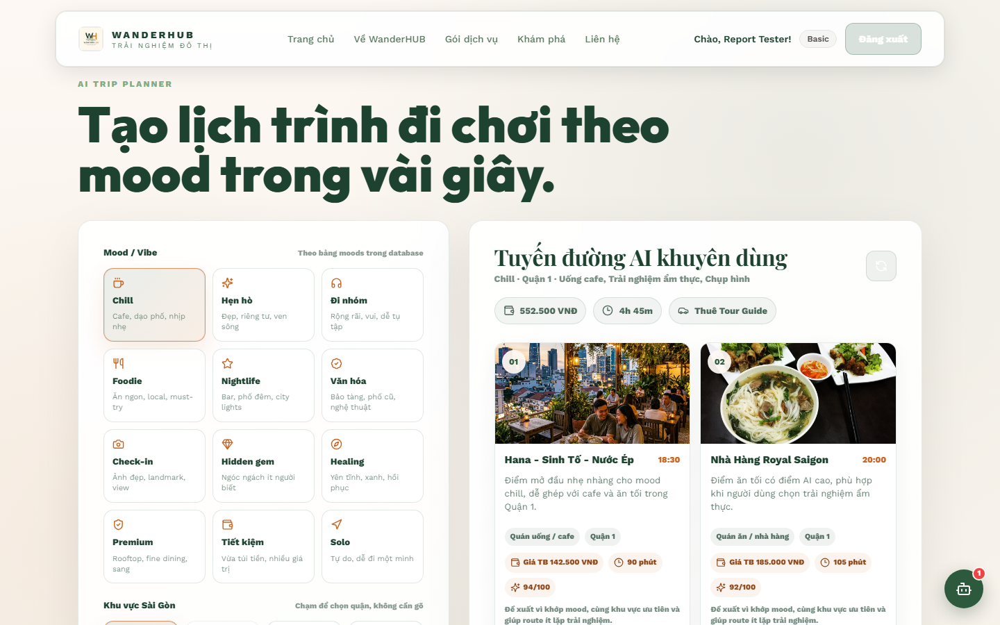
*Hình 2.11: Form chọn mood, ngân sách, khung giờ, khu vực, sở thích và phương tiện di chuyển.*

**(3) Giới hạn sử dụng theo gói, gắn với mô hình freemium.** Người dùng gói Free/Basic bị giới hạn số lần tạo lịch trình; khi đạt hạn mức, hệ thống tự động điều hướng sang trang Gói dịch vụ. Đây là cơ chế kỹ thuật cụ thể hóa vai trò của gói miễn phí: trải nghiệm thử, sau đó khuyến khích chuyển đổi sang gói trả phí.

**(4) Theo dõi tương tác hành vi.** Mọi hành động của khách trên kết quả gợi ý (xem, di chuột qua, nhấn xem chi tiết, chọn, lưu lại, không thích, yêu cầu đổi lộ trình) đều được ghi nhận kèm trọng số tương ứng. Đây là hạ tầng dữ liệu để cải thiện chất lượng gợi ý theo thời gian.

**(5) Chức năng đặt xe/hướng dẫn viên tích hợp.** Sau khi có lịch trình, khách nhập địa chỉ điểm đón và bấm kiểm tra xe — hệ thống tự động tìm và phân công tài xế khả dụng gần nhất, không yêu cầu khách chọn loại xe. Giá xe được tính dựa trên **tổng quãng đường thực tế** từ điểm đón đến điểm dừng đầu tiên cộng với các chặng tiếp theo — không chỉ tính khoảng cách giữa các điểm trong lịch trình. Sau khi tài xế xác nhận, khách nhận ngay thông tin tên tài xế, biển số xe và thời gian đến dự kiến.

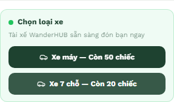
*Hình 2.12: Hệ thống tự động phân công tài xế và hiển thị thông tin xác nhận — tên tài xế, biển số, ETA và giá dự kiến tính từ điểm đón.*

**(6) Theo dõi hành trình thời gian thực.** Một bản đồ tương tác hiển thị các điểm dừng được nối bằng tuyến đường di chuyển, kèm marker tài xế di chuyển theo thời gian thực và danh sách trạng thái từng điểm. Khi đặt xe thành công, marker 🛵 xuất hiện tại vị trí điểm đón và tự di chuyển dần về phía điểm dừng đầu tiên, mô phỏng đường đi thực tế của tài xế đang đến đón khách.

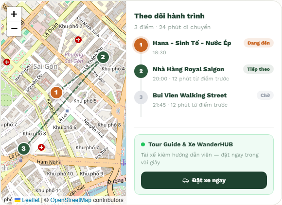
*Hình 2.13: Bản đồ Leaflet hiển thị các điểm dừng nối bằng tuyến đường, kèm marker tài xế và timeline trạng thái bên phải.*

**(7) Popup lịch trình cá nhân chi tiết (Itinerary Modal).** Sau khi đặt xe thành công, hệ thống hiển thị một toast thông báo kèm nút **"Đã hiểu, xem lịch trình"** — khách bấm vào để mở popup toàn màn hình hiển thị đầy đủ thông tin chuyến đi theo định dạng dễ đọc khi di chuyển thực tế. Popup bao gồm:

- **Header gradient** với tên mood/vibe, khu vực, phương tiện di chuyển và các chip tóm tắt hành trình.
- **Banner thông tin tài xế** (nếu đã đặt xe): tên tài xế, số xe, loại xe.
- **Danh sách điểm dừng chi tiết** — mỗi điểm hiển thị: số thứ tự, tên địa điểm, giờ đến dự kiến, chip danh mục/quận/thời lượng; và đặc biệt là **mô tả thực tế lấy từ dữ liệu OpenStreetMap**: loại ẩm thực (cuisine), các món/đồ uống nên thử, tiện ích nổi bật (wifi, máy lạnh, chỗ ngồi ngoài trời, phục vụ món chay…), giờ mở cửa, địa chỉ và số điện thoại. Thông tin này hoàn toàn dựa trên dữ liệu đối tác thật, không phải do AI tự phát sinh.
- **Mã QR cố định góc dưới bên phải** — khách hoặc bạn đồng hành có thể quét để mở lại lịch trình bất kỳ lúc nào; nếu lịch trình đã được lưu, QR dẫn thẳng đến đường link chia sẻ; nếu chưa lưu, QR mã hóa tóm tắt kế hoạch (tên các điểm dừng) để tiện tra cứu nhanh.

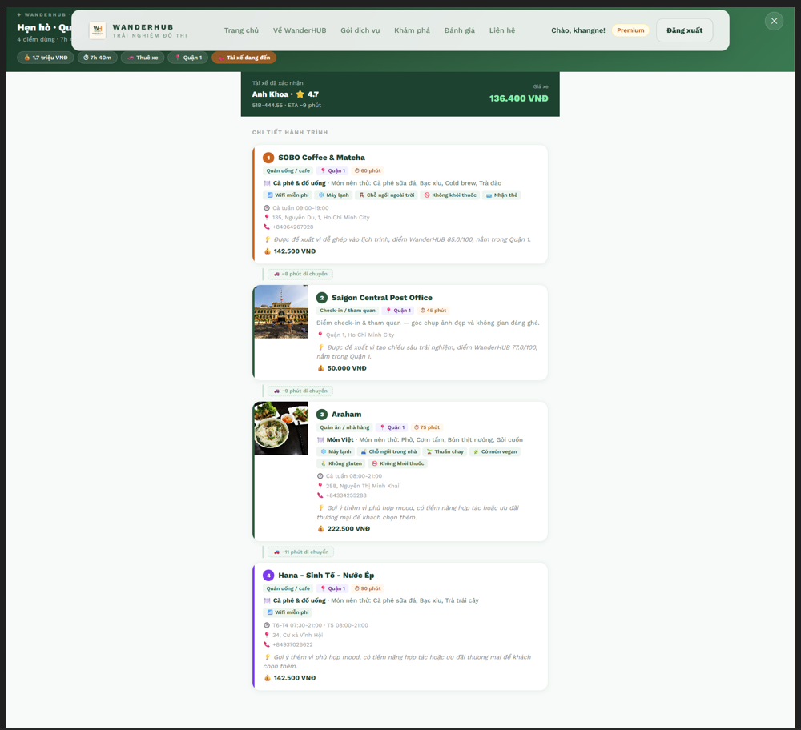
*Hình 2.14: Itinerary Modal — danh sách điểm dừng với đầy đủ thông tin thực tế: loại ẩm thực, gợi ý món, tiện ích, địa chỉ và giá tham khảo từng điểm.*

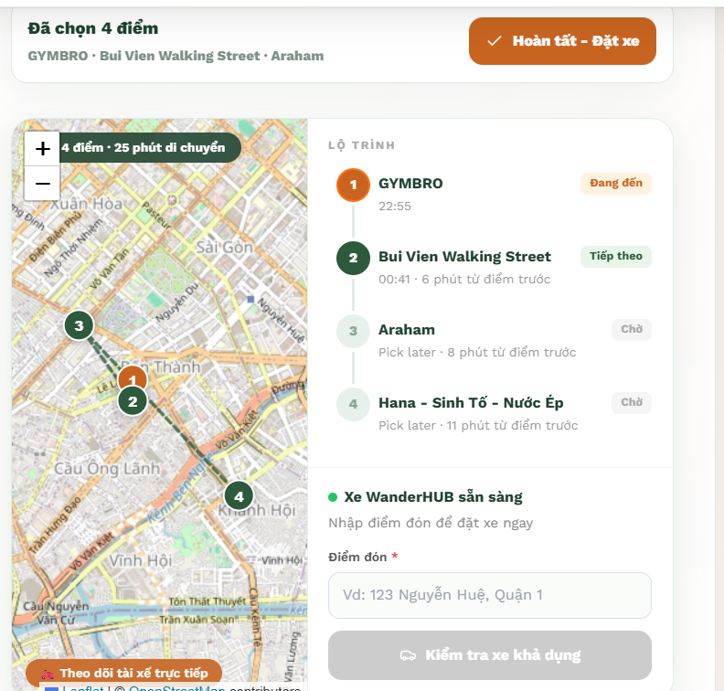
*Hình 2.15: Trang Planner sau khi AI tạo lịch trình — bản đồ bên trái, panel lộ trình liệt kê 4 điểm dừng theo thứ tự, phía dưới là phần chọn loại xe (xe máy / ô tô 7 chỗ) kèm giá.*

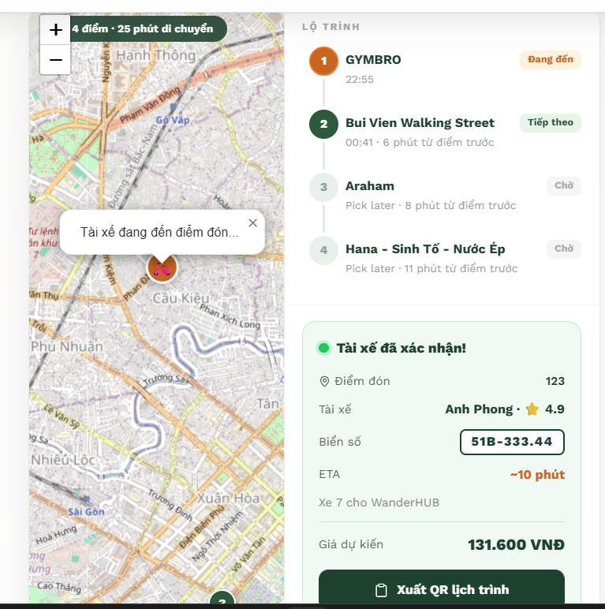
*Hình 2.16: Màn hình xác nhận đặt xe thành công — thông tin tài xế, bảng tính giá chi tiết theo từng km, tổng cước và nút "Kiểm tra QR Code" để chia sẻ hành trình.*

**(8) Gợi ý đối tác thương mại tích hợp lịch trình.** Sau kết quả lịch trình AI, hệ thống hiển thị thêm mục "Ngoài ra, có thể bạn quan tâm" với các điểm gợi ý từ đối tác thương mại trong khu vực. Khi khách bấm "Chọn" một địa điểm ở mục này, hệ thống thêm điểm đó vào **lịch trình thực tế** (không chỉ đánh dấu "đã chọn"): điểm xuất hiện trên bản đồ, được tính vào danh sách lộ trình, hiển thị trong popup lịch trình chi tiết và được cộng vào tổng quãng đường tính giá xe. Tổng số điểm đã chọn — cả từ tuyến AI lẫn từ đối tác — được hiển thị ngay trên nút "Đã chọn N điểm" để khách theo dõi.

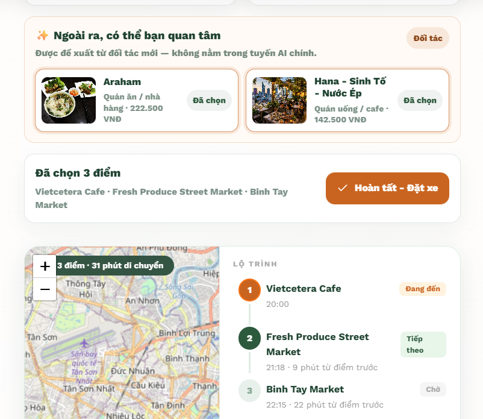
*Hình 2.17: Phần "Ngoài ra, có thể bạn quan tâm" — gợi ý đối tác kèm nút Chọn; thanh "Đã chọn 3 điểm" và nút "Hoàn tất - Đặt xe" hiển thị ngay sau khi khách thêm điểm đối tác vào lịch trình.*

**(9) Cổng thanh toán bằng mã QR.** Khi chọn gói trả phí, hệ thống hiển thị một cửa sổ thanh toán có mã QR sinh động riêng cho từng gói và mã giao dịch tham chiếu, kèm đầy đủ thông tin chuyển khoản (ngân hàng, số tài khoản, số tiền, nội dung chuyển khoản có gắn mã đối soát). Sau khi khách xác nhận đã thanh toán, hệ thống chuyển trạng thái từ "đang xác minh" sang "thành công" trước khi kích hoạt gói dịch vụ — mô phỏng đúng luồng thanh toán chuyển khoản ngân hàng phổ biến tại Việt Nam.

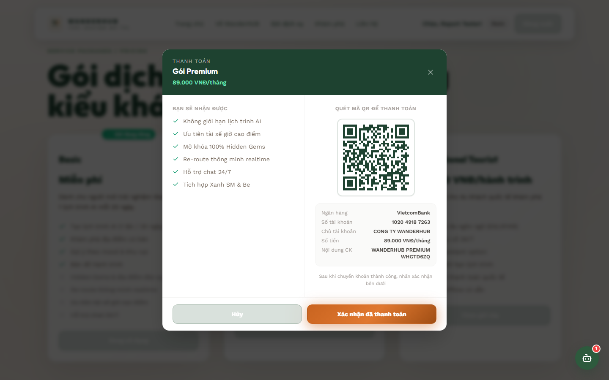
*Hình 2.18: Modal thanh toán — mã QR bên phải, danh sách quyền lợi bên trái, thông tin chuyển khoản phía dưới.*

**(10) Trợ lý ảo dạng chat.** Một cửa sổ chat nổi xuất hiện cố định trên mọi trang, sử dụng mô hình ngôn ngữ lớn để trả lời câu hỏi của khách theo thời gian thực, đóng vai trò hỗ trợ liên tục và giảm tải cho việc tư vấn thủ công.

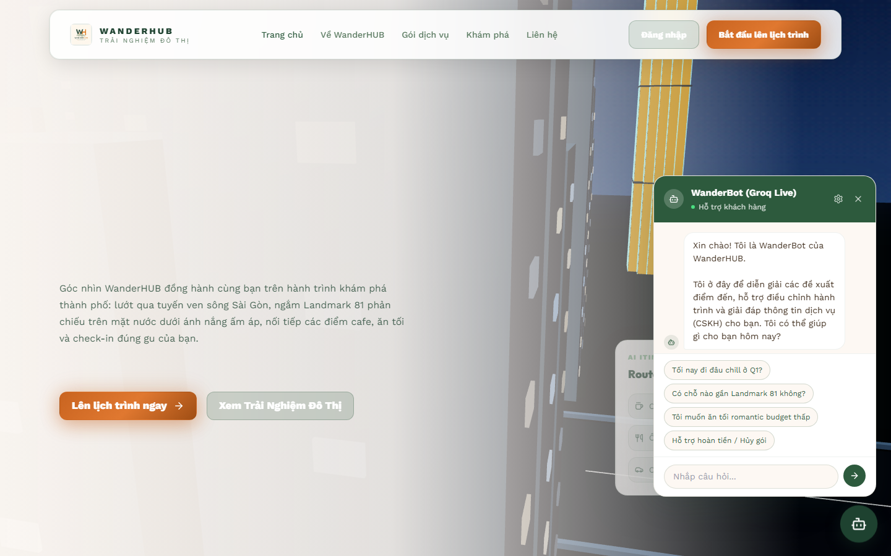
*Hình 2.19: Khung chat AI nổi ở góc màn hình, đang hiển thị hội thoại mẫu.*

**(11) Form liên hệ và hỗ trợ.** Trang Liên hệ cho phép khách gửi yêu cầu hỗ trợ trực tiếp đến hệ thống, bổ trợ cho những trường hợp nằm ngoài khả năng xử lý của chatbot.

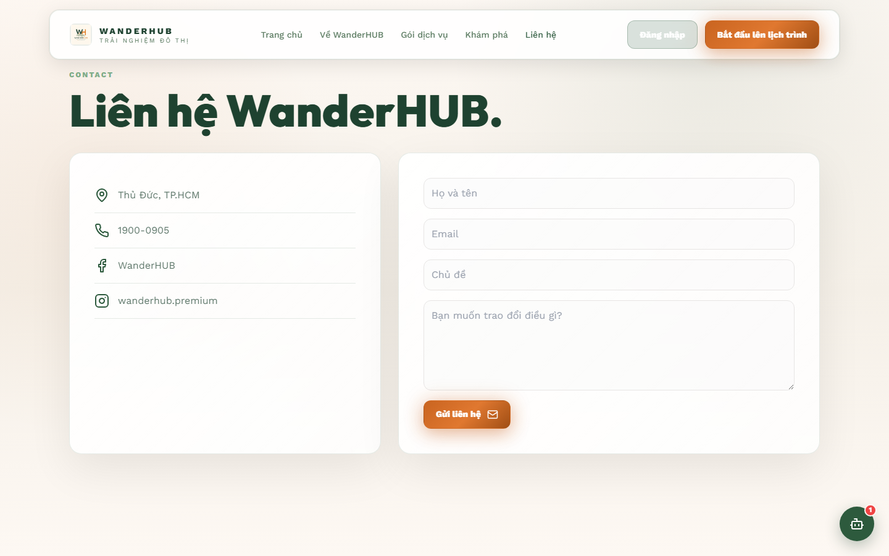
*Hình 2.20: Form liên hệ với các trường tên, email, chủ đề, nội dung.*

---

## 2.5. Quy trình giao dịch trên website

Quy trình giao dịch trên website được thiết kế thành một luồng liền mạch gồm mười bước:

**Bước 1 — Tiếp cận và nhận biết nhu cầu.** Khách đến website từ hai nguồn chính: trực tiếp qua tìm kiếm hoặc giới thiệu (vào trang chủ để tìm hiểu mô hình), hoặc từ các kênh truyền thông xã hội dẫn thẳng vào trang Gói dịch vụ hoặc trang Lên lịch trình.

**Bước 2 — Xác thực tài khoản.** Hệ thống yêu cầu đăng nhập hoặc đăng ký trước khi cho phép vào công cụ lập lịch trình hoặc chọn gói trả phí. Việc bắt buộc có tài khoản giúp gắn lịch sử sử dụng, hạn mức gói và dữ liệu hành vi vào đúng một người dùng.

**Bước 3 — Chọn gói dịch vụ.** Tại trang Gói dịch vụ, khách so sánh ba gói và chọn. Nếu chọn gói miễn phí, hệ thống lưu lựa chọn và chuyển khách vào trang lập lịch trình. Nếu chọn gói trả phí, hệ thống mở cửa sổ thanh toán.

**Bước 4 — Thanh toán.** Khách quét mã QR hoặc chuyển khoản theo thông tin hiển thị, sau đó bấm xác nhận đã thanh toán. Hệ thống chuyển trạng thái từ "đang xác minh" sang "thành công", ghi nhận gói mới cho tài khoản.

**Bước 5 — Nhập nhu cầu trải nghiệm.** Tại công cụ lập lịch trình, khách thiết lập các tham số: mood/vibe, khu vực, ngân sách, khung giờ, sở thích cụ thể và phương tiện di chuyển mong muốn. Hệ thống kiểm tra hạn mức sử dụng theo gói trước khi cho phép tạo lịch trình mới.

**Bước 6 — AI xử lý và trả kết quả.** Yêu cầu được gửi đến hệ thống xử lý, đối chiếu với toàn bộ đối tác phù hợp để chọn ra danh sách điểm dừng tối ưu kèm điểm số, sắp xếp theo trình tự thời gian và tổng hợp chi phí, thời lượng toàn tuyến.

**Bước 7 — Khách xem, tương tác và tinh chỉnh lịch trình.** Khách xem từng điểm dừng với đầy đủ hình ảnh, mô tả, điểm phù hợp và chi phí; có thể nhấn yêu cầu đổi lộ trình. Đồng thời, khách xem và có thể chọn thêm các gợi ý từ đối tác thương mại — những điểm được chọn tự động gia nhập lịch trình thực tế, thể hiện trên bản đồ và được cộng vào tổng quãng đường tính giá xe.

**Bước 8 — Đặt phương tiện di chuyển.** Nếu chọn hình thức "Thuê xe", khách nhập địa chỉ điểm đón và bấm kiểm tra xe — hệ thống tự động phân công tài xế khả dụng gần nhất mà không yêu cầu khách chọn loại xe. Sau khi xác nhận, khách nhận thông tin tài xế (tên, biển số, ETA) và giá dự kiến tính từ điểm đón đến hết lịch trình.

**Bước 9 — Theo dõi hành trình và xem lịch trình chi tiết.** Ngay sau khi đặt xe, toast thông báo xuất hiện kèm nút **"Đã hiểu, xem lịch trình"** — khách bấm vào để mở popup lịch trình cá nhân toàn màn hình với thông tin chi tiết từng điểm dừng (mô tả thực tế, giờ mở cửa, địa chỉ, số điện thoại), thông tin tài xế và mã QR để chia sẻ kế hoạch. Bản đồ đồng thời hiển thị marker tài xế 🛵 di chuyển từ điểm đón về hướng điểm dừng đầu tiên.

**Bước 10 — Sử dụng dịch vụ và hậu mãi.** Trong và sau khi trải nghiệm, khách có thể dùng trợ lý chat hoặc form liên hệ nếu gặp sự cố; với gói trả phí, lượt sử dụng được tự cập nhật. Hành vi tương tác tiếp tục được ghi nhận để làm đầu vào cho lần gợi ý kế tiếp chính xác hơn.

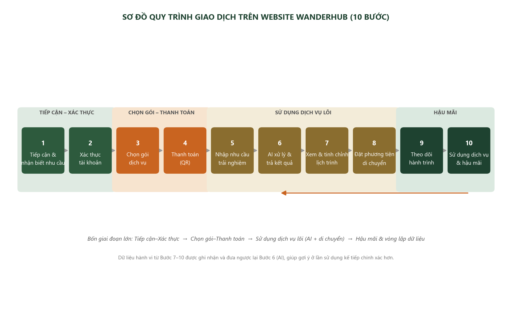
*Hình 2.21: Sơ đồ tổng hợp quy trình giao dịch trên website WanderHUB.*
> *(Hình tự vẽ bằng PowerPoint/Canva: sơ đồ khối 10 ô nối tiếp, nhóm 3 màu theo giai đoạn: Tiếp cận–Xác thực / Chọn gói–Thanh toán / Sử dụng dịch vụ–Hậu mãi.)*

Nhìn chung, mười bước trên cho thấy website không chỉ là một trang giới thiệu dịch vụ, mà là một hệ thống giao dịch hoàn chỉnh và khép kín — từ tiếp cận, xác thực, chọn gói, thanh toán, đến tạo và vận hành sản phẩm dịch vụ lõi, cùng với cơ chế hậu mãi và cải thiện liên tục dựa trên dữ liệu hành vi thực tế của khách hàng.

---

## 2.6. Bản đồ Pain Point – Giải pháp (Pain Point Mapping)

Để chứng minh website không chỉ "có chức năng" mà từng chức năng đều giải quyết một nỗi đau cụ thể của khách hàng mục tiêu, bảng dưới đây ánh xạ trực tiếp từng pain point sang tính năng tương ứng:

| Pain point của khách hàng | Biểu hiện cụ thể | Tính năng WanderHUB giải quyết | Vị trí trên website |
|---|---|---|---|
| Mất nhiều thời gian tự lên kế hoạch | Lưu hàng chục địa điểm từ TikTok/Google Maps nhưng không biết sắp xếp thành lịch trình | AI tạo lịch trình hoàn chỉnh trong vài giây từ 5 tiêu chí đầu vào | Trang Lên lịch trình (`/planner`) |
| Lịch trình không đúng sở thích cá nhân (tour đại trà) | Tour có sẵn trên Klook/KKday giống nhau cho mọi khách | Lựa chọn mood/vibe cá nhân hóa (chill, hẹn hò, foodie, nightlife, văn hóa, hidden gem…) làm đầu vào cho AI | Form chọn mood trong Planner |
| Sợ rủi ro, không biết chỗ nào đáng tin khi đến nơi lạ | Lo chọn nhầm quán, review không đúng thực tế | Mỗi điểm dừng có điểm AI (0–100), mô tả thực tế từ dữ liệu OSM (cuisine, giờ mở cửa, địa chỉ, điện thoại), ảnh thật và chi phí cụ thể | Thẻ điểm dừng + Itinerary Modal |
| Khó di chuyển, sợ kẹt xe/lạc đường, đặc biệt khách quốc tế | TP.HCM đông xe, khách không quen khu vực, phải tự đặt xe nhiều chặng | Hệ thống tự động phân công tài xế — khách chỉ cần nhập điểm đón, còn lại WanderHUB lo; bản đồ theo dõi hành trình thời gian thực | Vehicle booking + Journey Tracker |
| Muốn chia sẻ lịch trình với bạn đồng hành | Phải chụp màn hình hoặc sao chép link thủ công | Mã QR trong Itinerary Modal — bạn đồng hành quét là mở ngay kế hoạch | Itinerary Modal (góc dưới phải) |
| Phải nhắn tin chờ tư vấn thủ công với local tour | Mất thời gian chờ phản hồi, chất lượng phụ thuộc kinh nghiệm người tư vấn | AI tự động phản hồi ngay + trợ lý chat AI hỗ trợ 24/7 thay tư vấn viên | Planner + Floating Chatbot |
| Không biết nên chọn gói nào, sợ tốn tiền oan | Nhiều nền tảng không rõ giá trị từng mức giá | Mô hình freemium minh bạch: so sánh ✓/✗ theo từng gói, dùng thử Free trước khi trả phí | Trang Gói dịch vụ (`/pricing`) |
| Lo ngại thanh toán không minh bạch, sợ lừa đảo | E ngại chuyển khoản cho một nền tảng mới, chưa có thương hiệu lâu năm | Mã QR riêng theo từng giao dịch, hiển thị đầy đủ thông tin ngân hàng và mã đối soát, có bước xác minh trước khi kích hoạt gói | Payment Modal |

---

## 2.7. Hành trình khách hàng trên website (Customer Journey Map)

Khác với "quy trình giao dịch 10 bước" ở mục 2.5 (mô tả luồng thao tác kỹ thuật), bản đồ hành trình khách hàng dưới đây nhìn từ góc độ cảm xúc và nhận thức qua 5 giai đoạn:

| Giai đoạn | Điểm chạm (Touchpoint) | Hành động của khách | Cảm xúc / Suy nghĩ | Rủi ro rời bỏ | Giải pháp của WanderHUB |
|---|---|---|---|---|---|
| **1. Nhận biết** (Awareness) | Bài đăng Facebook, video TikTok, giới thiệu từ bạn bè | Thấy nội dung gợi ý lịch trình, click vào link dẫn về website | Tò mò nhưng còn nghi ngờ ("liệu có đúng nhu cầu của mình không?") | Rời trang nếu landing page tải chậm hoặc không khớp kỳ vọng từ nội dung social | Trang chủ tái hiện đúng nội dung đã thấy trên social (route mẫu, giọng văn nhất quán), tải nhanh nhờ kiến trúc SPA |
| **2. Tìm hiểu** (Consideration) | Trang chủ, Về WanderHUB, Khám phá, Gói dịch vụ | Đọc về mô hình AI, xem gói giá, so sánh với phương án tự đi/đặt Klook | Cân nhắc, so sánh giá trị nhận được so với chi phí và thời gian bỏ ra | Rời bỏ nếu không thấy rõ sự khác biệt so với tự lên kế hoạch miễn phí | Hero section minh họa cụ thể đầu ra AI; bảng giá có gói Free để dùng thử không rủi ro |
| **3. Quyết định** (Decision) | Trang Đăng nhập/Đăng ký, Pricing, Payment Modal | Tạo tài khoản, chọn gói, thanh toán (nếu chọn gói trả phí) | Hồi hộp khi nhập thông tin thanh toán, cần cảm giác an toàn | Rời bỏ ở bước đăng ký (friction) hoặc nghi ngờ ở bước thanh toán | Form đăng ký ngắn (3 trường), thanh toán hiển thị đầy đủ thông tin đối soát, có trạng thái xác minh rõ ràng |
| **4. Sử dụng** (Onboarding & Usage) | Planner, kết quả lịch trình, gợi ý đối tác, đặt xe, Journey Tracker, Itinerary Modal | Nhập nhu cầu, nhận lịch trình, chọn thêm điểm đối tác, đặt xe, di chuyển theo bản đồ, chia sẻ QR với bạn | Hào hứng nếu lịch trình đúng ý; lo lắng nếu sai tuyến khi đang di chuyển thực tế | Rời bỏ giữa luồng nếu lịch trình đầu tiên không khớp kỳ vọng, không tương tác lại lần sau | Cho phép đổi lộ trình (reroute); Itinerary Modal + QR giúp chia sẻ và tra cứu dễ dàng; bản đồ theo dõi thời gian thực giảm lo lắng |
| **5. Duy trì & Giới thiệu** (Retention & Advocacy) | Lượt sử dụng tiếp theo, trợ lý chat, trang Explore | Quay lại tạo lịch trình mới, đọc nội dung Explore, chia sẻ trải nghiệm và mã QR hành trình lên mạng xã hội | Hài lòng nếu gợi ý lần sau "hiểu mình hơn"; thất vọng nếu hệ thống lặp lại gợi ý cũ | Không quay lại nếu không thấy cá nhân hóa cải thiện theo thời gian | Dữ liệu tương tác làm gợi ý ngày càng sát nhu cầu; QR scannable khuyến khích lan truyền tự nhiên; nội dung Explore giữ chân giữa các lần đặt dịch vụ |

Điểm mấu chốt của bản đồ này là chỉ ra **hai "điểm rơi" nhạy cảm nhất**: (1) bước đăng ký/thanh toán ở giai đoạn Quyết định, và (2) trải nghiệm lần đầu với lịch trình AI ở giai đoạn Sử dụng — đây là hai khu vực được phân tích sâu hơn ở mục 2.8 dưới góc độ chuyển đổi.

---

## 2.8. Đánh giá UX/UI và phân tích quy trình chuyển đổi (Conversion Funnel)

### Đánh giá UX/UI theo 10 nguyên tắc heuristic của Nielsen

| Nguyên tắc | Mức độ đáp ứng | Quan sát trên website |
|---|---|---|
| Hiển thị trạng thái hệ thống | Đạt | Có trạng thái "Đang tính toán...", "Đang xác minh...", trạng thái xe "loading/selecting/booked", marker tài xế di chuyển thời gian thực rõ ràng theo từng bước |
| Phù hợp với thực tế người dùng | Đạt | Ngôn ngữ gần gũi ("vibe", "mood"), đơn vị tiền VNĐ, địa danh TP.HCM quen thuộc; mô tả địa điểm dùng từ ngữ thực tế từ dữ liệu OSM |
| Kiểm soát và tự do cho người dùng | Đạt một phần | Khách có thể đổi lựa chọn điểm dừng, yêu cầu reroute, bỏ chọn gợi ý đối tác; chưa thấy nút "Quay lại bước trước" rõ ràng trong luồng Planner nhiều bước |
| Tính nhất quán và chuẩn hóa | Đạt | Nút CTA, màu sắc (xanh đậm/cam), bố cục thẻ sản phẩm lặp lại nhất quán giữa Pricing, Planner, Explore, Itinerary Modal |
| Ngăn ngừa lỗi | Đạt một phần | Chưa thấy validate định dạng email hoặc độ mạnh mật khẩu phía giao diện trước khi gửi lên server |
| Nhận diện hơn là ghi nhớ | Đạt | Icon kèm nhãn chữ ở mọi lựa chọn (mood, transport, budget); mã QR trong Itinerary Modal giảm tải nhớ đường link |
| Linh hoạt và hiệu quả sử dụng | Đạt một phần | Người dùng mới và quay lại dùng cùng một luồng; QR chia sẻ hỗ trợ người dùng nhóm (bạn đồng hành quét được ngay); chưa có cơ chế lưu mẫu lịch trình yêu thích |
| Thiết kế thẩm mỹ và tối giản | Đạt | Phong cách "premium hospitality" đồng bộ, nhiều khoảng trắng, Itinerary Modal dạng info-only không có bản đồ giúp tập trung vào nội dung |
| Hỗ trợ nhận diện, chẩn đoán và khắc phục lỗi | Đạt một phần | Một số luồng có cơ chế dự phòng khi mất kết nối (Auth), nhưng Planner/Payment chưa thấy thông báo lỗi tường minh cho khách khi API thất bại |
| Trợ giúp và tài liệu | Đạt | Có FAQ, trang Điều khoản và chatbot AI hỗ trợ tức thời thay tài liệu tĩnh |

Kết quả: 7/10 nguyên tắc đạt mức tốt, 3/10 nguyên tắc đạt một phần — cho thấy giao diện đã đảm bảo tốt các nguyên tắc ảnh hưởng trực tiếp đến niềm tin giao dịch (trạng thái hệ thống, tính nhất quán, ngôn ngữ phù hợp người dùng), trong khi một số nguyên tắc liên quan đến kiểm soát luồng nhiều bước và xử lý lỗi vẫn còn có thể hoàn thiện thêm.

### Phân tích funnel chuyển đổi (Conversion Funnel)

| Bước trong funnel | Hành động của khách | Rủi ro rơi rụng (drop-off) |
|---|---|---|
| 1. Truy cập trang chủ | Khách xem hero, đọc giá trị cốt lõi | Rời ngay nếu không hiểu sản phẩm trong 5 giây đầu |
| 2. Vào trang Pricing/Planner | Khách xem gói hoặc thử nhập nhu cầu | Rời nếu bị yêu cầu đăng nhập ngay mà chưa thấy "giá trị" cụ thể |
| 3. Đăng ký/Đăng nhập | Tạo tài khoản | Rời nếu form dài hoặc lo ngại bảo mật |
| 4. Chọn gói dịch vụ | Chọn Free hoặc gói trả phí | Rời nếu không rõ sự khác biệt giữa các gói |
| 5. Thanh toán (nếu gói trả phí) | Quét QR, xác nhận | Rời nếu nghi ngờ độ tin cậy của giao dịch chuyển khoản |
| 6. Tạo lịch trình AI | Nhập nhu cầu, nhận kết quả | Rời nếu kết quả không khớp kỳ vọng ngay lần đầu |
| 7. Tinh chỉnh + chọn đối tác | Xem, chọn/bỏ điểm dừng, bổ sung gợi ý đối tác | Rời nếu không thấy cách tùy biến lịch trình theo ý mình |
| 8. Đặt xe / Hoàn tất trải nghiệm | Nhập điểm đón, hệ thống tự phân công tài xế | Rời nếu không có xe khả dụng hoặc ETA quá lâu |
| 9. Sử dụng trong hành trình | Theo dõi bản đồ, mở Itinerary Modal, chia sẻ QR | Thất vọng nếu thông tin địa điểm sai hoặc không đủ chi tiết |
| 10. Quay lại sử dụng lần sau | Tạo lịch trình mới, nâng cấp gói | Không quay lại nếu không thấy giá trị khác biệt giữa các lần dùng |

Nhìn theo toàn bộ funnel, hai điểm có rủi ro rơi rụng cao nhất là bước đăng ký/thanh toán (do liên quan trực tiếp đến thông tin cá nhân và tiền) và bước nhận kết quả lịch trình AI lần đầu (do quyết định ấn tượng đầu tiên về chất lượng cá nhân hóa) — trùng khớp với hai "điểm rơi" đã xác định ở bản đồ hành trình khách hàng (mục 2.7), qua đó củng cố rằng đây là hai khu vực cần được ưu tiên kiểm soát chất lượng trải nghiệm nhất trên toàn website.

